# Step-by-Step Guide to Creating a Kubernetes Cluster on Ubuntu 22.04

> 🔗 **Reference**: [Step-by-Step Guide by Priyantha Getc on Medium](https://medium.com/@priyantha.getc/step-by-step-guide-to-creating-a-kubernetes-cluster-on-ubuntu-22-04-using-containerd-runtime-0ead53a8d273)

## 🧭 Table of Contents

- [📌 What Are We Going to Build?](#what-are-we-going-to-build)
- [🧰 Requirements](#requirements)
- [🛠️ System Preparation](#system-preparation)
  - [🔍 Check the Port Availability](#check-the-port-availability)
  - [🧱 Disable Ubuntu Firewall](#disable-ubuntu-firewall--cp-w)
  - [🔄 Update and Upgrade the System](#update-and-upgrade-the-system--cp-w)
  - [⏱️ Enable Time-Sync with an NTP Server](#enable-time-sync-with-an-ntp-server--cp-w)
  - [📉 Turn Off the Swap](#turn-of-the-swap--cp-w)
  - [🧩 Configure Required Kernel Modules](#configure-required-kernel-modules--cp-w)
  - [🌐 Configure Network Parameters](#configure-network-parameters--cp-w)
  - [🧰 Install Necessary Software Tools to Continue](#install-necessary-software-tools-to-continue--cp-w)
- [📦 Install Kubernetes Tools & containerd Runtime](#install-kubernetes-tools--containerd-runtime)
  - [🔧 Install Kubernetes Tools](#install-kubernetes-tools)
    - [🔐 Add Kubernetes Repository and Keys](#add-kubernetes-repository-and-keys--cp-w)
  - [📦 Install containerd Runtime](#install-containerd-runtime)
    - [⚙️ Configure containerd](#configure-containerd--cp-w)
    - [🔎 Setup crictl](#setup-crictl-for-inspecting-containers--cp-w)
- [🚀 Enable kubelet Service](#enable-kubelet-service--cw-p)
- [🌟 Initializing Control-Plane Node](#initializing-control-plane-node)
  - [📥 Pull Necessary Kubernetes Images](#pull-necessary-kubernets-images--cp)
  - [🧪 Initialize the Control-Plane](#initialize-the-control-plane--cp)
  - [🕸️ Add Network Add-on](#add-network-add-on--cp)
- [🔗 Join the Worker Node to Kubernetes Control-Plane](#join-the-worker-node-to-kubernets-control-plane)
  - [🛠️ Generate the Join Command](#switch-to-the-control-plane-node-and-generate-the-join-command--cp)
  - [💻 Join from Worker Node](#switch-to-the-worker-node-and-follow-the-below-instructions--w)
  - [🔎 Verify on Control-Plane](#switch-back-to-the-control-plane-node-and-run-the-below-command-to-verify--cp)

---

## What Are We Going to Build?

We will set up a minimal Kubernetes (K8s) cluster on Ubuntu 22.04+ with:

- 1 **Control-plane (CP)** node
- 1 **Worker (W)** node
- Using **containerd** as the container runtime
- All configurations done manually (bare-metal or VM)

## Requirements

1.  Two computers, which could be physical machines, virtual machines, cloud
    compute instances, or containers
2.  Ubuntu 22.04 or a later version installed on both computers
3.  These two computers should be capable of communicating via a network, and
    firewalls should allow the necessary ports and protocols. For testing purposes
    within a closed network, you can disable firewalls on both computers
4.  Both computers should have unique hostnames. You can use ‘hostnamectl’ to set
    up the hostnames
5.  Both computers require internet access
6.  Superuser or root access is needed on both computers
    To verify system requirements, refer to the official Kubernetes documentation

Short terms used in this documentation

- **CP** — apply on control-plane node only
- **W** —apply on worker node only
- **CP-W** — apply on both control-plane and worker node

Before diving into the terminal, let’s review what needs to be followed. Creating a
mental model based on the following diagrams will make it easier to follow this

**guide Below steps are common for both control plane and worker nodes / CP-W**

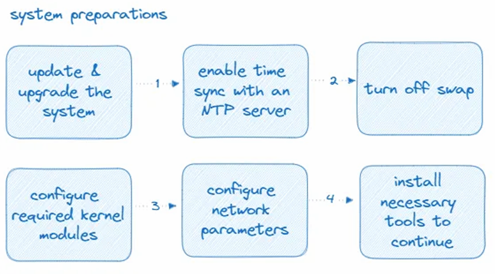

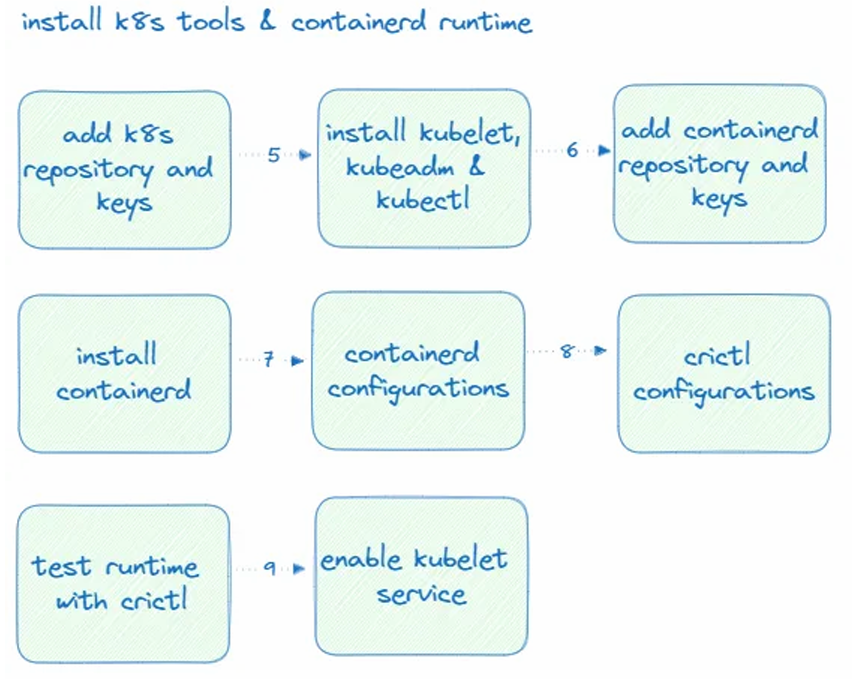

**Below steps for the control-plane node only / CP**

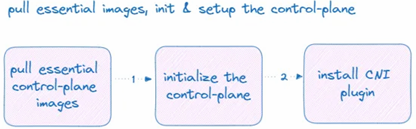

**Following steps will be executed in control-plane and worker node as specified / CP-W**

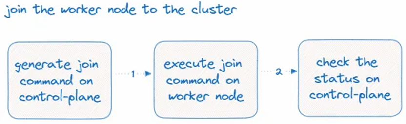

## System preparation

### Check the port availability

First, check for the required ports on both the control-plane and worker nodes. You can use the below command to verify the open state of a port

```
 sudo netstat -tulpn | grep <port-to-check>
```

If the port is free, this command should not display any processes associated with the relevant port. If you observe any process associated with any of the below ports, you’ll need to free them up first. (We’re not discussing customizing ports in this article. We’ll be using the default set of Kubernetes ports)

**command for control-plane / CP**

```
 sudo netstat -tulpn | grep "6443\|2379\|2380\|10250\|10259\|10257"
```

**command for worker node / W**

```
 sudo netstat -tulpn | grep "10250"
```

#### ⓘ ports — Extra information, feel free to skip

| Port        | Description               | Role             |
| ----------- | ------------------------- | ---------------- |
| 6443        | Kubernetes API server     | Control Plane    |
| 2379–2380   | etcd server communication | Control Plane    |
| 10250       | Kubelet API               | Both             |
| 10257       | Kube Controller Manager   | Control Plane    |
| 10259       | Kube Scheduler            | Control Plane    |
| 30000–32767 | NodePort Services         | Worker (default) |

### Disable Ubuntu Firewall / CP-W

For simplicity, We will disable the firewall on both nodes. DO NOT perform this on production servers or publicly exposed servers. In those cases, you must explicitly allow the above ports

```
 sudo ufw disable
```

check the status

```
 sudo ufw status
 > Status: inactive
```

**At this point, we are prepared to execute the steps outlined in the above diagrams. In this section, our focus will be on system preparations. Keep in mind, these steps are common for both nodes, CP-W**

### Update and upgrade the system / CP-W

```
 sudo apt update
 sudo apt -y full-upgrade
```

### Enable time-sync with an NTP server / CP-W

```
 sudo apt install systemd-timesyncd
 sudo timedatectl set-ntp true
```

Check the status

```
 sudo timedatectl status
```

**It should be displayed as follows: “NTP service: active”**

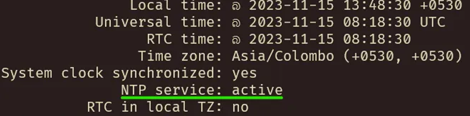

### Turn of the swap / CP-W

```
 sudo swapoff -a
 sudo sed -i.bak -r 's/(.+ swap .+)/#\1/' /etc/fstab
```

Check the status with free -m command

```
 free -m
```

Swap values should be 0 as in below screenshot
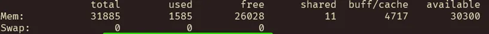

Check the fstab file as well. otherwise swap will be turned on automatically on reboot and you won’t be able to use k8s services properly

```
cat /etc/fstab | grep swap
```

The ‘swapfile’ entry should be commented out, as shown below


### Configure required kernel modules / CP-W

Create a file named k8s.conf in /etc/modules-load.d and add the following kernel modules to be loaded at startup

```
 sudo vim /etc/modules-load.d/k8s.conf
```

Add below content, save and close the file

```
 overlay
 br_netfilter
```

Load above modules to the current session

```
sudo modprobe overlay
sudo modprobe br_netfilter
```

Check the status

```
 lsmod | grep "overlay\|br_netfilter"
```

Output should be shown as below

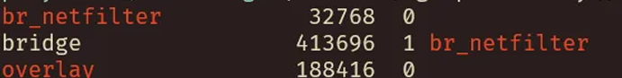

### Configure network parameters / CP-W

Create k8s.conf file in /etc/sysctl.d

```
 sudo vim /etc/sysctl.d/k8s.conf
```

Add below content, save and close the file

```
 net.bridge.bridge-nf-call-ip6tables = 1
 net.bridge.bridge-nf-call-iptables = 1
 net.ipv4.ip_forward = 1
```

Apply newly added network params

```
 sudo sysctl --system
```

### Install necessary software tools to continue / CP-W

```
 sudo apt-get install -y apt-transport-https ca-certificates curl \
  gpg gnupg2 software-properties-common
```

**Now, both nodes are ready to install Kubernetes tools and the runtime**

---

## Install Kubernetes Tools & containerd Runtime

**Install Kubernetes Tools**

### Add Kubernetes repository and keys / CP-W

First, check whether the /etc/apt/keyrings directory is present on your nodes. If not, create the directory using the command below

```
sudo mkdir -m 755 /etc/apt/keyrings
```

### Download and add the k8s repository key / CP-W

```
 curl -fsSL https://pkgs.k8s.io/core:/stable:/v1.32/deb/Release.key | \
  sudo gpg --dearmor -o /etc/apt/keyrings/kubernetes-apt-keyring.gpg
```

### Add Kubernetes repository in the source list / CP-W

```
 echo 'deb [signed-by=/etc/apt/keyrings/kubernetes-apt-keyring.gpg] https://pkgs.k8s.io/core:/stable:/v1.32/deb/ /' | \
  sudo tee /etc/apt/sources.list.d/kubernetes.list
```

### Update the package manager and install Kubernetes tools / CP-W

```
 sudo apt update
 sudo apt-get install -y kubelet kubeadm kubectl
 sudo apt-mark hold kubelet kubeadm kubectl
```

At this point, we have installed all the necessary Kubernetes tools. Kubernetes services such as API server and kube-scheduler are running as containers. Also, pods we deploy run as containers. Therefore, we need a platform to manage these containers. Although Docker is the most popular container runtime, Kubernetes has recently switched to containerd as the default runtime. While Docker or CRI-O can still be configured as the runtime, this tutorial will focus on the containerd runtime

## Install containerd runtime

If you are starting over with this tutorial, verify whether the overlay and br_netfilter kernel modules are loaded. If not, load them as we discussed earlier

```
 lsmod | grep "overlay\|br_netfilter"
```

### Add containerd repository key and add the repository to source list / CP-W

```
 curl -fsSL https://download.docker.com/linux/ubuntu/gpg | \
  sudo gpg --dearmor -o /etc/apt/keyrings/docker.gpg
```

```
 sudo chmod a+r /etc/apt/keyrings/docker.gpg
```

```
echo \
  "deb [arch="$(dpkg --print-architecture)" signed-by=/etc/apt/keyrings/docker.gpg] https://download.docker.com/linux/ubuntu \
  "$(. /etc/os-release && echo "$VERSION_CODENAME")" stable"
```

```
sudo tee /etc/apt/sources.list.d/docker.list > /dev/null
```

### Install containerd / CP-W

```
sudo apt update
sudo apt install -y containerd.io
```

### Configure containerd / CP-W

Create a directory to store containerd config file in /etc/

```
sudo mkdir -p /etc/containerd
```

Generate the default config toml file

```
sudo containerd config default|sudo tee /etc/containerd/config.toml
```

Open the generated file in any text editor and verify whether the following settings are present. If not, you should set them as shown below

```
[plugins."io.containerd.grpc.v1.cri".containerd.runtimes.runc]
  runtime_type = "io.containerd.runc.v2"  # <- note this, this line might have been missed
  [plugins."io.containerd.grpc.v1.cri".containerd.runtimes.runc.options]
    SystemdCgroup = true # <- note this, this could be set as false in the default configuration, please make it true
```

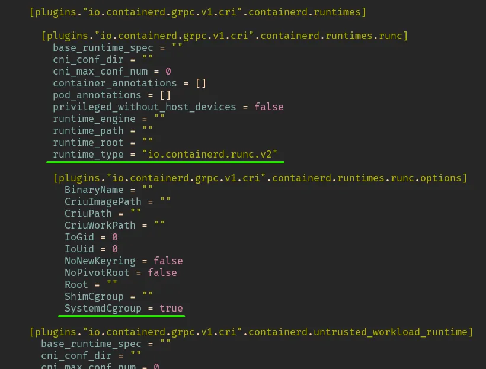

Additionally, at the beginning of this config file, you should see the ‘disabled_plugins’ set as an empty list ([ ]). Please verify that it is indeed empty

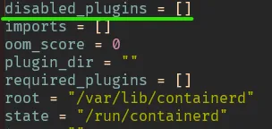

Now save the config file, close it and restart the containerd service

```
sudo systemctl restart containerd
sudo systemctl enable containerd
systemctl status containerd
```

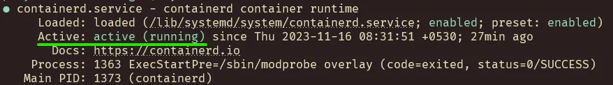

At this point, our runtime installation and configuration setup is completed. However, it’s beneficia to have _crictl_ for debugging purposes. You can use this tool to inspect running containerd containers, their status, and images. So, let’s configure _crictl_ as well

### Setup crictl for inspecting containers / CP-W

First run the below command and check the output

```
sudo crictl ps
```

If the crictl is not present, install it using the below command

```
sudo apt install cri-tools
```

Once the installation is completed, re-run the sudo crictl ps command. You may encounter output with errors and warnings. To address these issues, we need to add configurations for crictl. Additionally, you can customize the debug output using this config file

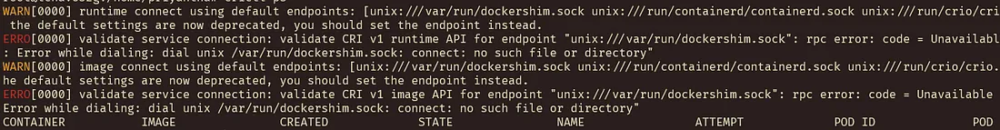

Create crictl.yaml file in /etc/

```
sudo vim /etc/crictl.yaml
```

Paste below content, save and exit

```
runtime-endpoint: unix:///run/containerd/containerd.sock
image-endpoint: unix:///run/containerd/containerd.sock
timeout: 2
debug: true # <- if you don't want to see debug info you can set this to false
pull-image-on-create: false
```

Run the `sudo crictl ps` again,and you shouldn’t encounter any errors or warnings

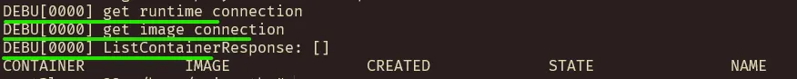

If you prefer not to see debug information, set the debug parameter to false in the `crictl.yaml` file

At this point, you won’t find any running containers. You can verify container images using the sudo crictl images command, and there won’t be any images present

### Enable kubelet service / CW-P

```
sudo systemctl enable kubelet
```

However, attempting to run the kubelet service will not be successful as the `kubectl configs` are missing. We won’t need to create these manually; they will be added to the system using kubeadm commands. Therefore, refrain from trying to start the kubelet service at this stage. Our current focus is on enabling the service only

**Now it is time to initiate our control plane node**

## Initializing Control-Plane Node

### Run the below command and check for existing images / CP

```
sudo crictl images
```

You won’t find any images at this point as it’s a fresh installation

### Pull necessary Kubernets images / CP

We don’t have to perform this as an isolated process, but for the sake of verifyin each small step, we’ll proceed with it separately

Run below command to pull images

```
sudo kubeadm config images pull --cri-socket unix:///var/run/containerd/containerd.sock
```

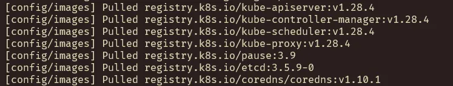

Now, if you execute the following command, you’ll see a list of containerd images

```
sudo crictl images
```

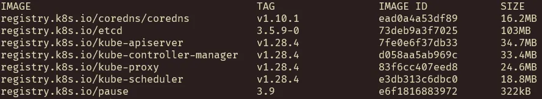

If you’re encountering extensive debug information, you can disable it as previously discussed in the crictl configuration section

### Initialize the control-plane / CP

**This command will take some time to complete. Do not clear the output as you’ll need to refer to instructions from the command output**

```
sudo kubeadm init \
  --pod-network-cidr=10.244.0.0/16 \
  --cri-socket unix:///var/run/containerd/containerd.sock \
  --v=5
```

If you have multiple container runtimes like Docker and containerd installed, you’ll need to specify the correct CRI socket. You can find these values in the official documentation. However, in our case, specifying the containerd socket should suffice

When selecting the pod-network-cidr range, choose a range that does not conflict with your network’s IP range

v=5 or higher would print verbose messages. This is useful when there are issues to fix

At the end of the command output, you will see something like the following

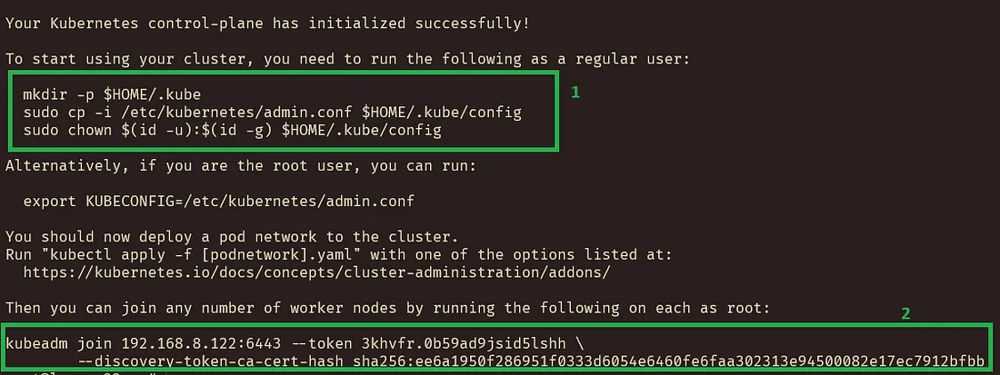

**DO NOT skip the instruction in the beginning (1).** Otherwise your kubectl won’t be connected with the API server. Even if you are running the cluster using the root user, you still need to follow this step. kubectl fetch the config from this location by default

error :

_couldn’t get current server API group list: Get “http://localhost:8080/api?timeout=32s": dial tcp 127.0.0.1:8080: connect: connection refused_

The connection to the server localhost:8080 was refused — did you specify the right host or port?

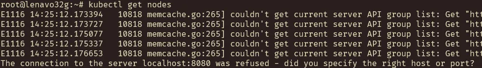

You will need the kubeadm join command (2) to connect the worker node with the control plane. However, you can always generate this. We’ll generate a new join command later when connecting our worker node with the control plane node

Run below command to copy config. You should perform this as a normal user if you plan to run kubectl with a regular user account. If you intend to run kubectl as root, execute it under the root account

```
 mkdir -p $HOME/.kube
 sudo cp -i /etc/kubernetes/admin.conf $HOME/.kube/config
 sudo chown $(id -u):$(id -g) $HOME/.kube/config
```

Now, if you run the command kubectl get nodes, it should work.
Run below kubectl command to get the cluster nodes

```
kubectl get nodes
```

Note that you can see the control-plane node here, but the status is not ready. We need to apply the CNI plugin to make this control-plane ready. Also, if you check the running containers using crictl ps, you should see something similar to the following

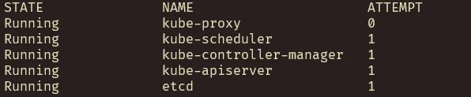

We are going to use `Weave Net` in this tutorial as our CNI plugin

### Add network add-on / CP

you can use below command

```
kubectl apply -f https://github.com/weaveworks/weave/releases/download/v2.8.1/weave-daemonset-k8s.yaml
```

Once you run the above command and still see the control-plane node in Not Ready status check the sudo crictl ps output. If it shown as below,

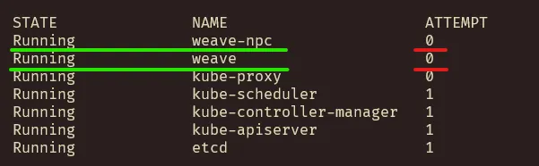

Just restart your control-plane server and check. Before restarting your control-plane server, exercise caution. If your node has a dynamic IP interface and its IP changes upon restarting, the control-plane may not function correctly. Kubernetes utilizes IP as a component to sign certificates for network security

You would now see there is one or more attempts and the control plane is ready

```
sudo crictl ps
kubectl get nodes
```

At this point, your control plane node is ready. Let’s proceed to configure the worker node

## Join the Worker Node to Kubernets Control-Plane

In this section, we’ll switch between the control plane and worker node to execute various commands. Pay attention to the short codes for each

### Switch to the control-plane node and generate the join command / CP

As you already know, during the initialization of the control-plane, there was a join command provided. You can use it instead of generating a new one. However, it’s advisable to generate a new one, considering that the token has a short lifespan

Use the below command in the control plane node to generate the join command

```
kubeadm token create --print-join-command
```

It would display something similar to the following in the console

```
kubeadm join 192.168.8.120:6443 — token dg67p7.wvt7n5zxx9pxbmaz — discovery-token-ca-cert-hash sha256:36f9eb64ef8a6d45254b8994108b0e3a56e856bcb3b07d46cd83554db4114490
```

`Copy` the entire command as we’ll need this to join the worker node with the control-plane.

### Switch to the worker node and follow the below instructions / W

Verify whether you’ve completed all the steps marked as CP-W or W in the previous sections

`Execute the join command you copied from the control-plane console.` You’ll receive something similar to the following

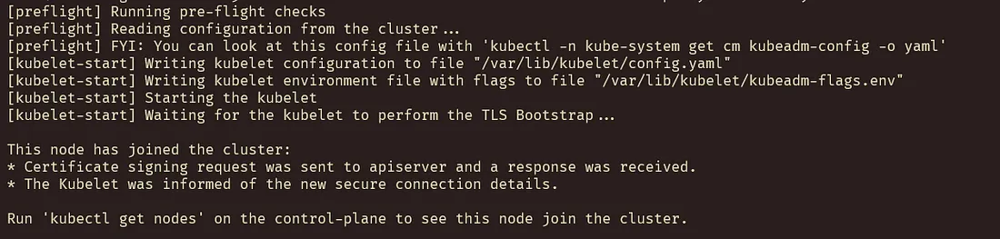

### Switch back to the control-plane node and run the below command to verify / CP

```
kubectl get nodes -o wide
```

Congratulations! At this stage, you have a functional minimum Kubernetes cluster
