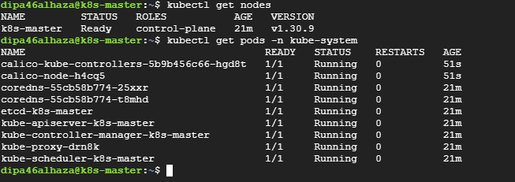

# **Final Result of Control-Plane Nodes** ✅

### ✅ **Running Pods on kube-system:**



🎉 **Great news! Your Kubernetes cluster is up and running correctly!** 🚀

### ✅ **What’s Working:**

- **Control Plane (`etcd`, `kube-apiserver`, `kube-scheduler`, `kube-controller-manager`):** All are running smoothly. ✅
- **Networking (`calico`):** Both `calico-node` and `calico-kube-controllers` are running without issues. ✅
- **Core DNS (`coredns`):** Working and ready for service discovery. ✅
- **Node Status:** The `k8s-master` node is `Ready` and part of the cluster. ✅

---

### 📊 **Current Cluster Summary:**

- **Kubernetes Version:** v1.30.9
- **Container Runtime:** `containerd`
- **Networking:** Calico
- **Control Plane Node:** `k8s-master` (Ready)

---

### 🚀 **Next Steps (Optional but Recommended):**

1. **Check Cluster Information:**
   ```bash
   kubectl cluster-info
   ```
2. **Deploy a Test Application:**

   ```bash
   kubectl create deployment nginx --image=nginx
   kubectl expose deployment nginx --port=80 --type=NodePort
   ```

   Then check if the service is working:

   ```bash
   kubectl get svc nginx
   ```

3. **Install Kubernetes Dashboard (for visual management):**
   ```bash
   kubectl apply -f https://raw.githubusercontent.com/kubernetes/dashboard/v2.7.0/aio/deploy/recommended.yaml
   ```

---

### 💡 **Pro Tip: Save Time with Alias Commands**

Add this to your `~/.bashrc`:

```bash
alias k="kubectl"
alias kns="kubectl config set-context --current --namespace"
```

Then reload:

```bash
source ~/.bashrc
```

---

# 📌 **Explanation of Each Pod in `kube-system` Namespace** from Your Final Setup:

Your Kubernetes control plane is up, and you have several essential system pods running. Here's a brief explanation of each:

---

### 🚀 **1. `coredns` Pods (`coredns-xxxxx`)**

- **Purpose:** CoreDNS provides **internal DNS** for service discovery within the cluster.
- **Function:** Resolves Kubernetes service names (e.g., `nginx.default.svc.cluster.local`) to their internal cluster IPs.
- **Without CoreDNS:** Pods cannot communicate using service names.

---

### 🚀 **2. `calico-node` Pods (`calico-node-xxxxx`)**

- **Purpose:** Calico is a **CNI (Container Network Interface)** plugin.
- **Function:** Manages **pod-to-pod communication** across nodes using BGP (Border Gateway Protocol).
- **Without Calico:** Pods cannot communicate across nodes.

---

### 🚀 **3. `calico-kube-controllers` Pod (`calico-kube-controllers-xxxxx`)**

- **Purpose:** Manages Calico **network policies** and handles IP address management.
- **Function:**
  - Enforces **network policies** (e.g., restrict pod access).
  - Manages **IP address assignment** and garbage collection for terminated pods.
- **Without it:** Network policies won’t work correctly.

---

### 🚀 **4. `kube-apiserver` Pod (`kube-apiserver-xxxxx`)**

- **Purpose:** The **control plane entry point** for managing the cluster.
- **Function:**
  - Accepts `kubectl` commands and routes them to the proper components.
  - Exposes the Kubernetes API on port `6443`.
- **Without it:** `kubectl` commands fail, and the cluster becomes unusable.

---

### 🚀 **5. `etcd` Pod (`etcd-xxxxx`)**

- **Purpose:** A distributed **key-value store** for the cluster’s **state**.
- **Function:**
  - Stores **configuration**, **secrets**, **service states**, and **pod information**.
  - Critical for Kubernetes **high availability** and **data recovery**.
- **Without it:** Cluster state is lost, and Kubernetes stops working.

---

### 🚀 **6. `kube-scheduler` Pod (`kube-scheduler-xxxxx`)**

- **Purpose:** **Assigns pods to nodes**.
- **Function:**
  - Determines which node is suitable for a pod based on **resources** and **affinities**.
  - Implements pod scheduling policies.
- **Without it:** Pods remain in a `Pending` state and never start.

---

### 🚀 **7. `kube-controller-manager` Pod (`kube-controller-manager-xxxxx`)**

- **Purpose:** **Controls cluster operations** via controllers.
- **Function:**
  - Maintains the desired state (e.g., **replica sets**, **deployments**, **service endpoints**).
  - Manages **node health checks**, **pod replication**, and **garbage collection**.
- **Without it:** No pod self-healing, replication, or scaling.

---

### 🚀 **8. `kube-proxy` Pod (`kube-proxy-xxxxx`)**

- **Purpose:** Handles **network traffic routing** for services.
- **Function:**
  - Manages **iptables** or **IPVS** rules to route requests from services to pods.
  - Enables **external access** via **NodePort** or **LoadBalancer** services.
- **Without it:** Pods cannot communicate with services, and external access fails.

---

### 📝 **Summary of Pod Functions in Your Cluster:**

| **Pod Name**                 | **Role**                   | **Critical Function**                                       |
| ---------------------------- | -------------------------- | ----------------------------------------------------------- |
| 🧩 `coredns`                 | **DNS Service**            | Resolves internal service names (e.g., `svc.cluster.local`) |
| 🧩 `calico-node`             | **CNI Network Manager**    | Manages pod-to-pod networking between nodes                 |
| 🧩 `calico-kube-controllers` | **Network Policy Manager** | Enforces network policies, manages pod IPs                  |
| 🧩 `kube-apiserver`          | **API Gateway**            | Processes all `kubectl` commands and exposes the API        |
| 🧩 `etcd`                    | **Cluster Database**       | Stores Kubernetes state (pods, services, configs)           |
| 🧩 `kube-scheduler`          | **Pod Scheduler**          | Assigns new pods to suitable nodes                          |
| 🧩 `kube-controller-manager` | **State Manager**          | Ensures pods match their desired state                      |
| 🧩 `kube-proxy`              | **Service Router**         | Routes traffic between services and pods                    |

---
